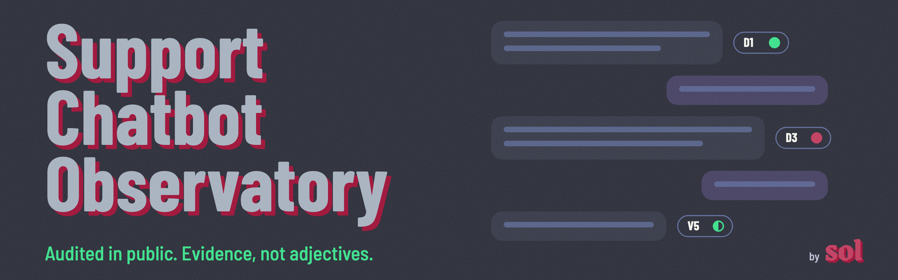
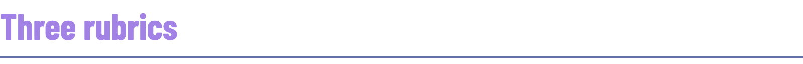
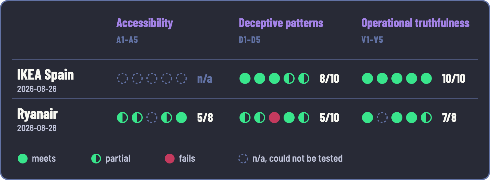
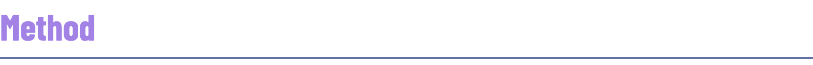
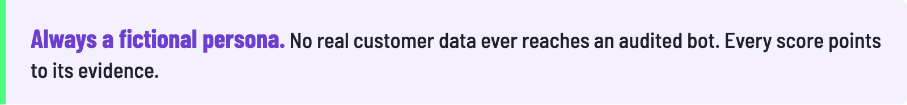
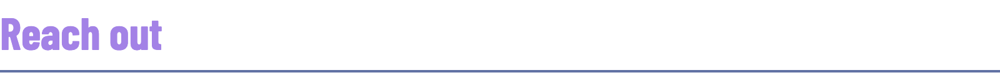

Public audits of the support chat widgets of international brands.

Every chatbot is scored against three versioned rubrics. Each criterion has a measurable definition, a defined test and required evidence.

<h3></h3>

♿ **[Accessibility](metodo/rubrica-accesibilidad.md).** Keyboard, focus, screen reader, contrast, timeouts. Anchored to [WCAG 2.2](https://www.w3.org/TR/WCAG22/).

🎭 **[Deceptive patterns](metodo/rubrica-patrones-enganosos.md).** Declared identity, cost of the path to a human, data taken before any help, difficulty of leaving, usability of the answer.

🔍 **[Operational truthfulness](metodo/rubrica-veracidad-operativa.md).** Whether the bot knows what it claims to know, and does what it claims to have done.

Methodological base: the [taxonomy of failures in an agentic system](metodo/taxonomia-de-fallas.md).

<h3 id="results"></h3>

Each criterion scores 2, 1 or 0. A criterion that could not be tested is n/a, and n/a never counts as zero: the score reads "X out of Y applicable". Higher is better.

📄 Full reports, with transcripts and evidence: [IKEA Spain](fichas/ikea/ficha.md) · [Ryanair](fichas/ryanair/ficha.md). More sites in progress.

<h3></h3>

<picture>
  <source media="(prefers-color-scheme: dark)" srcset="images/persona-dark.png">
  
</picture>

🧪 **Forensic tone.** Measurable data and evidence, never adjectives.

🌐 **Original language.** This page and the rubrics are in English. Reports and transcripts stay in the language the bot answered in: translating a transcript would falsify the evidence.

<h3></h3>

Know a support bot worth auditing? Think a score is wrong? Let me know!

- 🐛 [Open an issue](https://github.com/missyeahhh/chatbot-observatory/issues): suggest a site, challenge a score, ask about the method.
- 💬 [Message me on LinkedIn](https://www.linkedin.com/in/soldr): feedback, or how you would use it.

---

🎨 Made by [Soledad De Rosa](https://www.linkedin.com/in/soldr). Built with [Claude Code](https://claude.com/claude-code). [CC BY 4.0](LICENSE): reuse it, citing the source.
